# Subject Center Atomic Vertical Slice v1

> Base: `docs/overview/logic-overview.v3.md`  
> Goal: 在 Subject Center（Who）與 Workspace（What）架構下，定義符合「原子化垂直切片」規則的完整功能切片邏輯圖。

## 1) 原子化垂直切片規則（強制）

1. 一個 Command 僅能修改一個 Aggregate。  
2. 一個 Transaction 僅允許提交單一 Aggregate。  
3. 所有跨 BC 的狀態同步必須透過 Domain Event。  
4. 不得跨 BC 直接寫入或讀取對方 Domain Model。  
5. Projection 僅為讀模型，不承載不變量，不得回寫 Domain。  
6. Domain Event 只能由 Aggregate 產生，不得由 Application Layer 產生。  
7. Application Layer 僅負責流程協調，不得實作領域規則。  
8. Aggregate 是唯一一致性邊界，所有強一致性必須封裝於其內。  
9. 若一個行為需要修改兩個 Aggregate，必須拆分為兩個 Command 並以 Saga 協調。  
10. Projection 必須可由事件完整重建。  
11. 權限驗證可讀 Projection 快照，高風險操作必須回源 Aggregate 確認。  
12. 任何欄位若可由事件推導，則不得持久化存儲。  
13. 跨 Aggregate 的狀態關聯必須是最終一致，而非同步強一致。  
14. 切片的最小單位是「完整業務行為」，而非資料模型或資料表。  
15. 若一個模組需要知道其他 Aggregate 的內部狀態，表示邊界設計錯誤。  

## 2) 原子化垂直功能切片邏輯圖

```mermaid
flowchart TD
  %% ---------------------------
  %% Subject Center (Who)
  %% ---------------------------
  subgraph SUBJECT_CENTER[Subject Center（Who）]
    subgraph IDENTITY[Identity Layer]
      identity_account_auth[identity-account.auth]
    end

    subgraph ACCOUNT[Account Layer]
      account_user_profile[account-user.profile]
      account_user_wallet[account-user.wallet.aggregate]
      account_user_notification[account-user.notification]
      account_user_skill[account-user.skill.aggregate]
      account_governance_role[account-governance.role]
      account_governance_policy[account-governance.policy]
      account_governance_notification_router[account-governance.notification-router]
      account_org_core[account-organization.core.aggregate]
      account_org_event_bus[account-organization.event-bus]
      account_org_member[account-organization.member]
      account_org_team[account-organization.team]
      account_org_partner[account-organization.partner]
      account_org_policy[account-organization.policy]
      account_org_skill_tag[account-organization.skill-tag]
      account_org_schedule[account-organization.schedule.aggregate]
    end
  end

  %% ---------------------------
  %% Workspace (What)
  %% ---------------------------
  subgraph WORKSPACE[Workspace Container（What）]
    subgraph APP_LAYER[Application Coordination]
      workspace_application[workspace-application]
      cmd_gateway[unified-command-gateway]
      scope_guard[workspace-application.scope-guard]
      policy_engine[workspace-application.policy-engine]
      tx_runner[workspace-application.transaction-runner]
      outbox[workspace-application.outbox]
    end

    subgraph WORKSPACE_CORE[Workspace Core]
      workspace_core[workspace-core.aggregate]
      workspace_event_bus[workspace-core.event-bus]
      workspace_event_store[workspace-core.event-store]
    end

    subgraph WORKSPACE_GOV[Workspace Governance]
      workspace_gov_members[workspace-governance.members]
      workspace_gov_role[workspace-governance.role]
      workspace_gov_teams[workspace-governance.teams]
      workspace_gov_partners[workspace-governance.partners]
      workspace_gov_schedule[workspace-governance.schedule]
      workspace_gov_audit[workspace-governance.audit]
      workspace_gov_audit_convergence[workspace-governance.audit-convergence]
    end

    subgraph WORKSPACE_BIZ[Workspace Business]
      workspace_daily[workspace-business.daily]
      workspace_schedule[workspace-business.schedule.aggregate]
      workspace_files[workspace-business.files]
      workspace_parser[workspace-business.document-parser]
      workspace_parsing_intent[workspace-business.parsing-intent]
      workspace_workflow[workspace-business.workflow.aggregate]
      workspace_tasks[workspace-business.tasks]
      workspace_qa[workspace-business.quality-assurance]
      workspace_acceptance[workspace-business.acceptance]
      workspace_finance[workspace-business.finance]
      workspace_issues[workspace-business.issues]
    end
  end

  %% ---------------------------
  %% Projection & Shared Kernel
  %% ---------------------------
  subgraph PROJECTION[Projection Layer（Read Model）]
    event_funnel[projection.event-funnel]
    projection_workspace_view[projection.workspace-view]
    projection_workspace_scope[projection.workspace-scope-guard]
    projection_account_view[projection.account-view]
    projection_account_audit[projection.account-audit]
    projection_account_schedule[projection.account-schedule]
    projection_org_view[projection.organization-view]
    projection_account_skill_view[projection.account-skill-view]
    projection_org_eligible_member_view[projection.org-eligible-member-view]
    projection_registry[projection.registry]
  end

  subgraph SHARED_KERNEL[Shared Kernel]
    sk_event[events/event-envelope]
    sk_authority[identity/authority-snapshot]
    sk_skill_tier[skills/skill-tier]
    sk_skill_requirement[workforce/skill-requirement]
    sk_schedule_contract[workforce/schedule-proposed-payload]
  end

  %% ---------------------------
  %% Atomic flow constraints
  %% ---------------------------
  cmd_gateway --> workspace_application
  workspace_application --> scope_guard --> policy_engine --> tx_runner
  tx_runner -->|1 Command / 1 Aggregate| workspace_core
  tx_runner -->|pending events| outbox --> workspace_event_bus
  account_org_schedule -->|Domain Event| account_org_event_bus
  workspace_event_bus --> event_funnel
  account_org_event_bus --> event_funnel
  event_funnel --> projection_workspace_view
  event_funnel --> projection_workspace_scope
  event_funnel --> projection_account_view
  event_funnel --> projection_account_audit
  event_funnel --> projection_account_schedule
  event_funnel --> projection_org_view
  event_funnel --> projection_account_skill_view
  event_funnel --> projection_org_eligible_member_view
  event_funnel --> projection_registry
  workspace_event_store -.->|replay| event_funnel
```

## 3) 功能完整性清單（所有功能必須存在）

| Slice | Exists in repo | Atomic slice role |
|---|---|---|
| `identity-account.auth` | Yes | Identity command entry |
| `account-governance.role` | Yes | Account governance aggregate behavior |
| `account-governance.policy` | Yes | Account policy behavior |
| `account-governance.notification-router` | Yes | Cross-context notification routing |
| `account-user.profile` | Yes | User profile behavior |
| `account-user.wallet` | Yes | Wallet aggregate |
| `account-user.notification` | Yes | User notification delivery |
| `account-user.skill` | Yes | Skill XP aggregate + ledger |
| `account-organization.core` | Yes | Organization core aggregate |
| `account-organization.event-bus` | Yes | Organization domain event bus |
| `account-organization.member` | Yes | Internal member behavior |
| `account-organization.team` | Yes | Team view behavior |
| `account-organization.partner` | Yes | External partner behavior |
| `account-organization.policy` | Yes | Organization policy behavior |
| `account-organization.skill-tag` | Yes | Skill tag pool behavior |
| `account-organization.schedule` | Yes | Organization scheduling aggregate |
| `workspace-application` | Yes | Coordination only (no domain rule) |
| `workspace-core` | Yes | Workspace aggregate |
| `workspace-core.event-bus` | Yes | Workspace domain event bus |
| `workspace-core.event-store` | Yes | Event replay/audit source |
| `workspace-governance.members` | Yes | Access governance behavior |
| `workspace-governance.role` | Yes | Role governance behavior |
| `workspace-governance.teams` | Yes | Compatibility stub slice |
| `workspace-governance.partners` | Yes | Compatibility stub slice |
| `workspace-governance.schedule` | Yes | Compatibility stub slice |
| `workspace-governance.audit` | Yes | Governance audit behavior |
| `workspace-governance.audit-convergence` | Yes | Audit convergence behavior |
| `workspace-business.daily` | Yes | Daily operation behavior |
| `workspace-business.schedule` | Yes | Workspace schedule behavior |
| `workspace-business.files` | Yes | File behavior |
| `workspace-business.document-parser` | Yes | Parsing intent behavior |
| `workspace-business.parsing-intent` | Yes | Parsing intent contract behavior |
| `workspace-business.tasks` | Yes | Task tree behavior |
| `workspace-business.quality-assurance` | Yes | QA behavior |
| `workspace-business.acceptance` | Yes | Acceptance behavior |
| `workspace-business.finance` | Yes | Finance behavior |
| `workspace-business.issues` | Yes | B-track issue behavior |
| `projection.event-funnel` | Yes | Unified projection event entry |
| `projection.workspace-view` | Yes | Workspace read model |
| `projection.workspace-scope-guard` | Yes | Scope-guard read model |
| `projection.account-view` | Yes | Account read model |
| `projection.account-audit` | Yes | Account audit read model |
| `projection.account-schedule` | Yes | Account scheduling read model |
| `projection.organization-view` | Yes | Organization read model |
| `projection.account-skill-view` | Yes | Skill read model (tier derived) |
| `projection.org-eligible-member-view` | Yes | Eligible member read model |
| `projection.registry` | Yes | Projection offset/version registry |

## 4) 合規檢查（對應 15 條規則）

- Command/Transaction 原子性：由 `workspace-application.transaction-runner` 保障單命令單聚合提交。
- 跨 BC 同步：僅經由 `workspace-core.event-bus`、`account-organization.event-bus` 與 `projection.event-funnel`。
- Projection 不回寫：所有 projection 僅接收事件並產生讀模型。
- 事件來源：Domain Event 由各 aggregate 產生，Application Layer 僅編排。
- 強一致邊界：僅存在於各自 aggregate 內部。
- 多 aggregate 行為：以 Saga/事件編排達成最終一致，不做同步雙寫。
- 可重建性：`workspace-core.event-store -> projection.event-funnel` 支援重播重建。
- 權限檢查：先讀 `projection.account-view` / `projection.workspace-scope-guard`，高風險操作回源 aggregate。
- 可推導欄位不落庫：例如 tier 由 `getTier(xp)` 推導。
