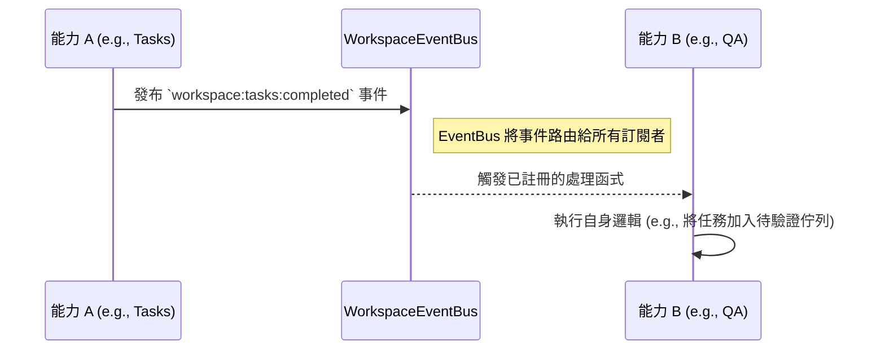

# 架構邊界 (Architectural Boundaries)

本文件定義了系統中各個邏輯層之間的明確邊界和依賴規則，旨在確保程式碼的模組化、可測試性和長期可維護性。

## 核心原則：單向依賴

本專案強制執行嚴格的**單向依賴流 (One-Way Dependency Flow)**。每一層只能依賴於其下方或平級的層，嚴禁向上或跨級依賴，以防止循環依賴和義大利麵式程式碼 (Spaghetti Code)。

**依賴鏈 (Dependency Chain):**

`app` → `view-modules` → `use-cases` → `react-providers` → `react-hooks` → `server-commands` → `firebase` / `genkit-flows` / `shared` → `domain-rules` → `domain-types`

---

## 各層職責與邊界

### 1. `domain-types` - 類型層 (Foundation)
- **職責**: 定義整個應用程式的 TypeScript 類型和介面，是系統的「通用語言」。
- **邊界**: **零依賴**。此層不能導入任何其他專案層級的檔案。

### 2. `domain-rules` - 業務規則層 (Business Logic)
- **職責**: 包含純粹、無副作用、與框架無關的業務邏輯函式（例如：`filterVisibleWorkspaces`, `buildTaskTree`）。
- **邊界**: 只能依賴 `domain-types` 層。嚴禁依賴 React 或任何 I/O。

### 3. `shared` - 共享工具層 (Shared Utilities)
- **職責**: 包含全域共享的工具函式（`cn`, `formatBytes`）、shadcn/ui 元件、常數和 i18n 類型。
- **邊界**: 只能依賴 `domain-types` 層（`app-providers` 例外，允許導入 `@/firebase`）。

### 4. `firebase` - 基礎設施層 (Infrastructure)
- **職責**: 封裝所有與外部服務（如 Firebase）的互動。這是唯一允許直接呼叫 SDK 的地方。
- **邊界**: 只能依賴 `domain-rules`, `domain-types` 和 `shared` 層。嚴禁了解任何關於 React 或 UI 的概念。

### 5. `genkit-flows` - AI 流程層 (AI Flows)
- **職責**: 封裝所有 Genkit/Gemini AI 流程（僅限伺服器端）。
- **邊界**: 只能依賴 `domain-types` 層。

### 6. `server-commands` - 伺服器命令層 (Server Commands)
- **職責**: `"use server"` 非同步函式，是唯一負責資料修改的入口。
- **邊界**: 可以依賴 `firebase`, `genkit-flows`, `domain-rules`, `domain-types` 和 `shared` 層。

### 7. `react-hooks` - 邏輯層 (Logic)
- **職責**: 封裝可重用的業務邏輯或 UI 邏輯。作為 UI 與 `firebase` 層之間的橋樑。
- **邊界**: 可以依賴 `server-commands`, `firebase`, `domain-rules`, `domain-types` 和 `shared` 層。

### 8. `react-providers` - 狀態層 (State)
- **職責**: 管理全域或共享的應用程式狀態。
- **邊界**: 可以依賴 `react-hooks`, `server-commands`, `firebase`, `domain-rules`, `domain-types` 和 `shared` 層。

### 9. `use-cases` - 用例層 (Use Cases)
- **職責**: 協調多個 server-commands 和 domain 邏輯來完成一個完整的業務操作。
- **邊界**: 可以依賴 `react-providers`, `react-hooks`, `server-commands`, `firebase`, `domain-rules`, `domain-types` 和 `shared` 層。

### 10. `view-modules` - 元件層 (UI)
- **職責**: 包含可重用的「智慧」UI 視圖元件，組合 hooks 和 use-cases 進行渲染。
- **邊界**: 可以依賴 `use-cases`, `react-providers`, `react-hooks`, `domain-types` 和 `shared` 層。**嚴禁**直接呼叫 `firebase` 層。

### 11. `app` - 應用層 (Entry)
- **職責**: Next.js 的路由入口，負責組合頁面、佈局和元件。
- **邊界**: 作為最頂層，可以依賴所有下層。**任何其他層都不能依賴 `app` 層**。

---

## 工作區與能力邊界 (Workspace & Capability Boundaries)

除了上述的靜態分層邊界，系統在運行時還存在一個重要的動態邊界：**工作區 (Workspace)**。

### A. 工作區 (Workspace)
- **定義**: 一個邏輯上被隔離的容器，封裝了特定的數據（如 `tasks`, `issues`）和功能（即「能力」）。
- **邊界**: 每個工作區都擁有一個獨立的 `WorkspaceEventBus` 實例。工作區內的所有操作和通訊都應被限制在此邊界內。

### B. 能力 (Capability)
- **定義**: 一個獨立、可插拔的功能模組（如 `Tasks`, `QA`, `Finance`），被「掛載」到一個工作區上運行。
- **邊界**: 不同的能力之間是**完全解耦**的。它們不知道彼此的存在，也不得直接互相導入或呼叫。

### C. 事件驅動通訊 (Event-Driven Communication)
- **機制**: 為了在解耦的前提下實現能力之間的協作，所有跨能力的通訊**必須**透過 `WorkspaceEventBus` 進行。這遵循「發布-訂閱 (Publish-Subscribe)」模式。
- **規則**: 一個能力（發布者）可以發布一個事件，而其他能力（訂閱者）可以監聽並響應這些事件。這是唯一允許的跨能力通訊方式。

**流程視覺化:**

- **嚴格禁止**: **嚴禁**一個能力（例如 `WorkspaceTasks`）的檔案直接 `import` 另一個能力（例如 `WorkspaceQA`）中的任何函數或組件。所有互動都必須透過事件匯流排。
