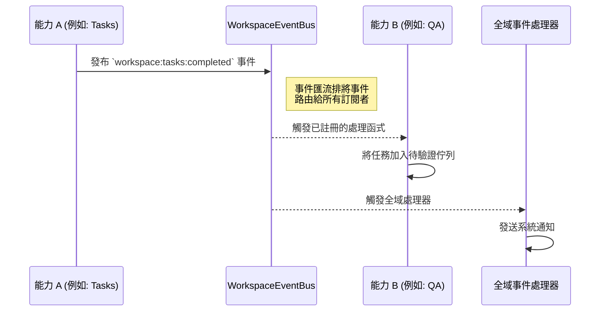
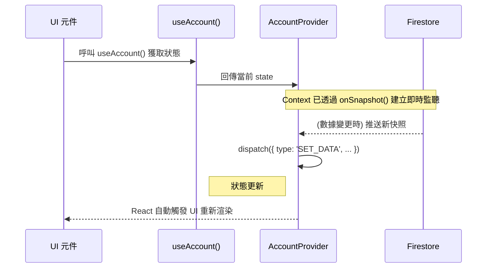
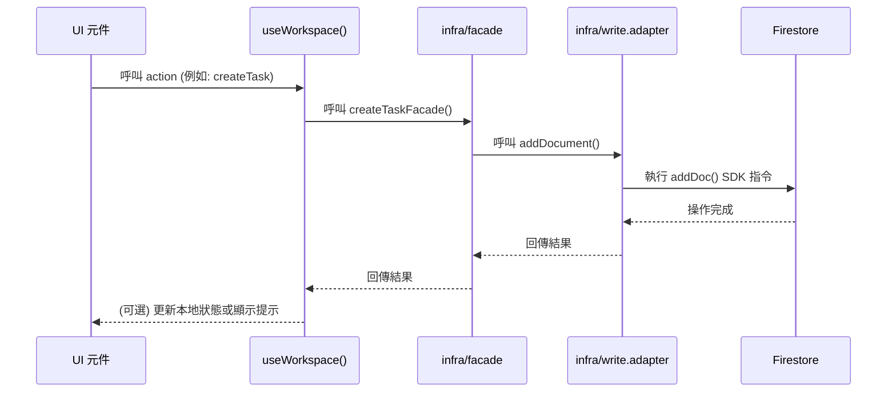

# 專案互動模型 (Project Interaction Model)

本文件使用圖表來視覺化地說明系統中不同部分之間的互動方式，旨在闡明數據流、控制流和組件之間的通訊模式。

---

## 1. 高階分層互動模型

本專案遵循嚴格的單向依賴原則。數據和控制流從高層（UI）流向低層（基礎設施），確保了程式碼的清晰和可維護性。

```mermaid
graph TD
    subgraph UI Layer
        A[應用層 app] --> B(視圖模組 features/{name}/_components)
    end
    subgraph Logic & State Layer
        B --> C{features/{name}/_hooks}
        C --> D[features/{name}/_components (provider) 全域狀態]
    end
    subgraph Server & Data Layer
        D --> E(server-commands 伺服器命令)
        E --> F[shared/infra]
    end
    subgraph External Services
        F --> G((Firebase 服務))
    end

    style A fill:#e9f5ff,stroke:#b3d4ff
    style B fill:#e9f5ff,stroke:#b3d4ff
    style C fill:#dcfce7,stroke:#a7f3d0
    style D fill:#dcfce7,stroke:#a7f3d0
    style E fill:#ffedd5,stroke:#fed7aa
    style F fill:#ffedd5,stroke:#fed7aa
    style G fill:#fde2e4,stroke:#fecaca
```

**流程解讀**:
1.  **應用層 (`app`)** 組合 UI 視圖元件來建構頁面。
2.  **視圖模組 (`features/{name}/_components`)** 從 hooks 和 use-cases 中獲取邏輯和數據，並將使用者互動傳遞給它們。
3.  **Hooks (`react-hooks`)** 封裝業務邏輯，並從 Providers 中讀取或更新狀態。
4.  **Providers (`features/{name}/_components (provider)`)** 作為狀態容器，並呼叫伺服器命令層來執行資料操作。
5.  **伺服器命令層 (`server-commands`)** 是 `"use server"` 資料修改的唯一入口。
6.  **基礎設施層 (`firebase`)** 是唯一與外部服務（如 Firebase）直接通訊的地方。

---

## 2. 工作區事件驅動模型

在單一工作區內，不同的「能力 (Capabilities)」之間是解耦的。它們不直接互相呼叫，而是透過一個共享的 `WorkspaceEventBus` 來通訊。



**流程解讀**:
1.  **能力 A** (如 `Tasks`) 在完成一個操作後，向 `WorkspaceEventBus` 發布一個事件。
2.  `Event Bus` 檢查所有訂閱了該事件的監聽器。
3.  **能力 B** (如 `QA`) 和 **全域事件處理器** 等訂閱者接收到事件並執行各自的邏輯，實現了模組間的低耦合協作。

---

## 3. 數據讀取與寫入流程

### A. 數據讀取 (UI 如何獲取數據)

UI 元件透過 Hooks 從 Context 中被動地接收數據。Context 負責監聽來自 Firestore 的即時更新。



### B. 數據寫入 (使用者操作如何更新數據庫)

使用者操作透過一個清晰、單向的流程觸發後端數據的變更。


