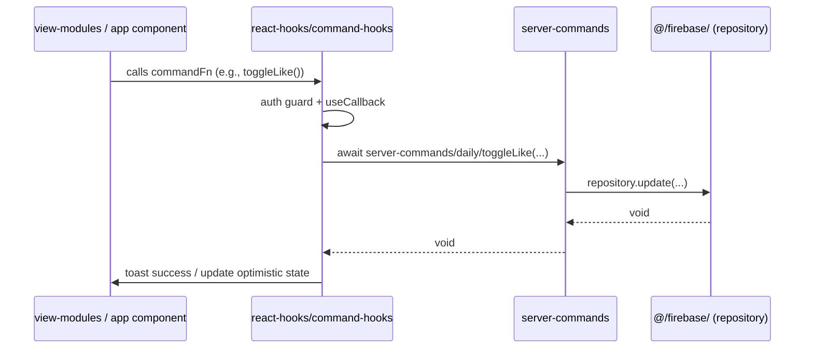
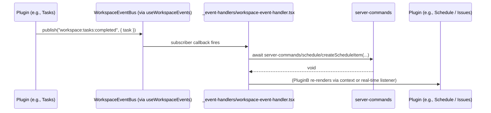
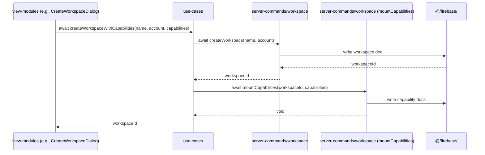
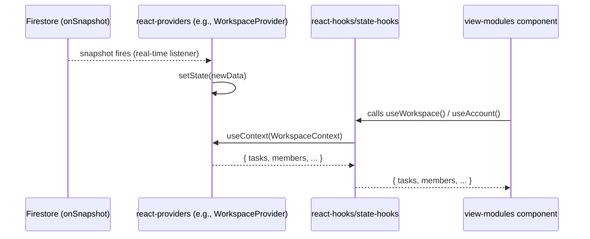

# Data Flow Reference (`src/shared/FLOWS.md`)

This document defines the **standard data flow paths** for this application.  
When in doubt about where a piece of logic belongs or how data should move, consult this file.

---

## Architecture Overview

```
app (pages/layouts)
  │
  ├── react-providers (global state: AppProvider, AccountProvider, WorkspaceProvider)
  │     └── react-hooks (state-hooks, command-hooks, service-hooks)
  │           └── server-commands (async Firebase writes/reads)
  │                 ├── domain-rules (pure validation, no I/O)
  │                 └── @/firebase/ (Firestore repositories)
  │
  └── use-cases (multi-step orchestrations + view bridges)
        └── server-commands → @/firebase/
```

One-way dependency rule: **no layer may import from a layer above it**.

---

## Flow A: UI Action → Firebase Write (Standard Command Flow)

Use this flow for any user-triggered write that is **self-contained** within one plugin/feature.



**Decision rule**: Use this path when:
- The action involves exactly **1 domain** (e.g., bookmarks, likes, task status)
- No cross-plugin coordination is needed after the write

---

## Flow B: Cross-Plugin Coordination (Event Bus Flow)

Use this flow when one plugin needs to **notify** another plugin after completing an operation, without coupling them directly.



**Decision rule**: Use this path when:
- The action in Plugin A triggers a **side effect in a different plugin** (Plugin B)
- You want zero direct import coupling between Plugin A and Plugin B
- Events are defined in `use-cases/workspace/event-bus/workspace-events.ts`

---

## Flow C: Multi-Step Orchestration (Use-Cases Flow)

Use this flow when a user action requires **≥ 2 server-command calls** that must succeed atomically.



**Decision rule**: Use this path when:
- The use case spans **≥ 2 server-command calls**
- Both calls must succeed (atomically grouped in a use-case function)
- The orchestration is **React-free** (callable from Server Actions too)

---

## Flow D: Real-Time State (Provider / Listener Flow)

Use this flow when a component needs **live data** that updates automatically from Firestore.



**Decision rule**: Use this path when:
- Data changes in real-time and UI must stay in sync without user action
- Multiple components across the tree need the same data

---

## Quick Decision Guide

| Situation | Use |
|-----------|-----|
| Single-plugin user write (like, bookmark, update status) | **Flow A** — command hook |
| Plugin A triggers side effect in Plugin B | **Flow B** — event bus |
| Single action needs ≥ 2 Firebase writes | **Flow C** — use-case |
| Live data needed by multiple components | **Flow D** — provider listener |
| Pure data validation or business rule check | `domain-rules` directly (no flow needed) |

---

## Event Bus vs Direct Command: When to Choose

| | Event Bus | Direct Command |
|---|-----------|---------------|
| **Coupling** | Zero (publisher doesn't know subscribers) | Explicit (caller knows callee) |
| **Use when** | Cross-plugin coordination | Single-plugin or sequential write |
| **Traceability** | Via `_event-handlers/workspace-event-handler.tsx` | Via hook → server-command call stack |
| **Defined in** | `use-cases/workspace/event-bus/workspace-events.ts` | `server-commands/{domain}/{domain}.commands.ts` |

> See `docs/events.md` for the full list of workspace events and their payloads.
