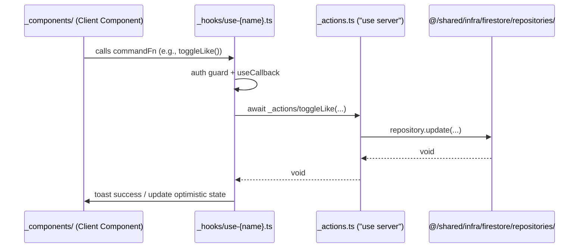
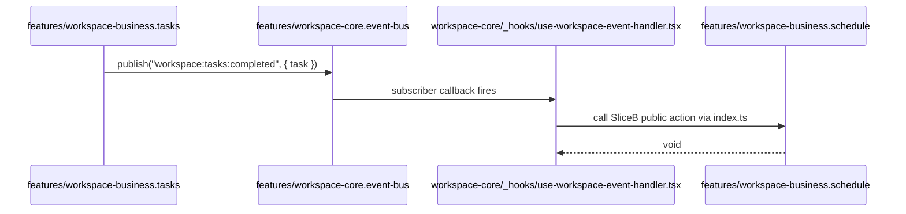
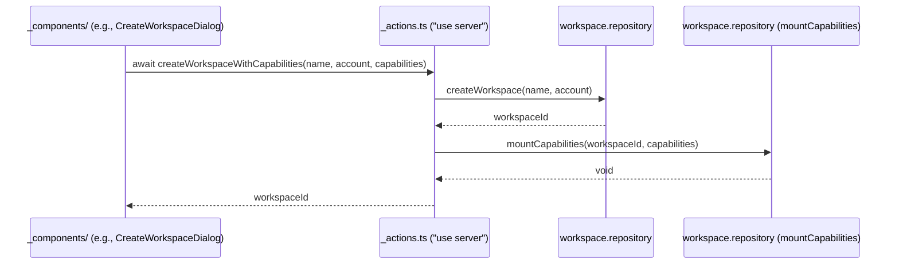
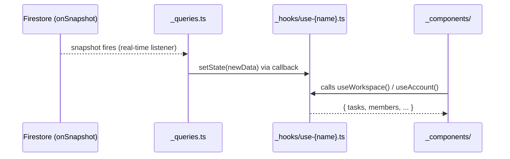

# Data Flow Reference (`src/shared/FLOWS.md`)

This document defines the **standard data flow paths** for this application.  
When in doubt about where a piece of logic belongs or how data should move, consult this file.

---

## Architecture Overview (VSA)

```
app/ (pages/layouts)
  │
  └── features/{slice}/index.ts (public API)
        ├── _components/    ← UI (React, "use client" where needed)
        ├── _hooks/         ← Client state hooks
        ├── _actions.ts     ← "use server" mutations
        └── _queries.ts     ← Firestore reads / onSnapshot
              │
              └── @/shared/infra/ (repositories, adapters)
                    └── Firebase SDK
```

One-way dependency rule: **`app → features → shared`. No layer imports from a layer above it.**

---

## Flow A: UI Action → Firebase Write (Standard Command Flow)

Use this flow for any user-triggered write that is **self-contained** within one feature slice.



**Decision rule**: Use this path when:
- The action involves exactly **1 domain** (e.g., bookmarks, likes, task status)
- No cross-slice coordination is needed after the write

---

## Flow B: Cross-Slice Coordination (Event Bus Flow)

Use this flow when one slice needs to **notify** another slice after completing an operation, without coupling them directly.



**Decision rule**: Use this path when:
- The action in Slice A triggers a **side effect in a different slice** (Slice B)
- You want zero direct import coupling between Slice A and Slice B
- Access Slice B only through its `index.ts` public API

---

## Flow C: Multi-Step Orchestration (Single Action → Multiple Writes)

Use this flow when a user action requires **≥ 2 repository calls** that must succeed together.



**Decision rule**: Use this path when:
- The use case spans **≥ 2 repository calls**
- Both calls must succeed (orchestrated in the same `_actions.ts` function)
- The orchestration is **React-free**

---

## Flow D: Real-Time State (Query / Listener Flow)

Use this flow when a component needs **live data** that updates automatically from Firestore.



**Decision rule**: Use this path when:
- Data changes in real-time and UI must stay in sync without user action
- Multiple components across the tree need the same data

---

## Quick Decision Guide

| Situation | Use |
|-----------|-----|
| Single-slice user write (like, bookmark, update status) | **Flow A** — command in `_actions.ts` |
| Slice A triggers side effect in Slice B | **Flow B** — event bus |
| Single action needs ≥ 2 repository writes | **Flow C** — orchestrated `_actions.ts` |
| Live data needed by multiple components | **Flow D** — `_queries.ts` listener |
| Pure data validation or business rule check | `@/shared/lib` directly (no flow needed) |

---

## Event Bus vs Direct Import: When to Choose

| | Event Bus | Direct Cross-Slice Import |
|---|-----------|--------------------------|
| **Coupling** | Zero (publisher doesn't know subscribers) | Explicit (caller imports from `index.ts`) |
| **Use when** | Cross-slice coordination after a write | Sequential write within one slice |
| **Traceability** | Via `workspace-core.event-bus` handler | Via hook → `_actions.ts` call stack |
| **Boundary rule** | Always emit events, never reach into another slice's `_` files | Import only `index.ts` public API |
